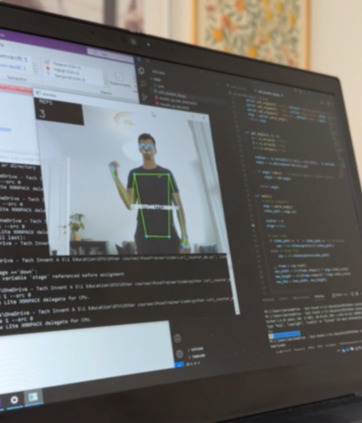
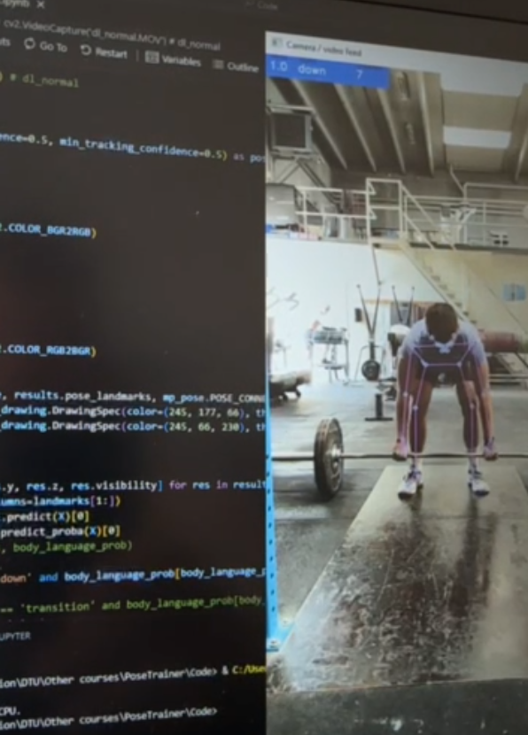
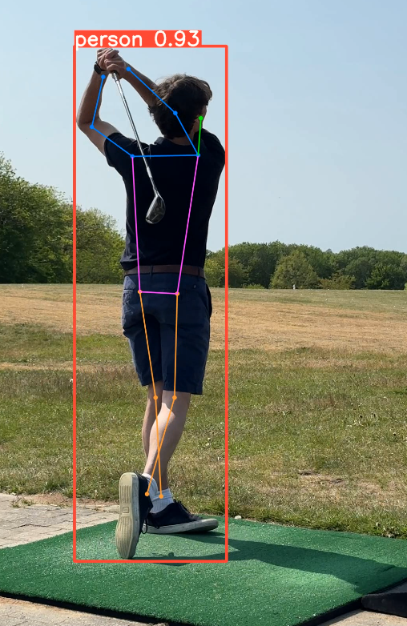

# humanpose
This repo contains scripts used for testing mediapipe and yolo.

`deadlift.ipynb` has been extended to use information from mediapipe to train and evaluate a machine learning classification model.
It should be used for educational / testing purposes.

  
  
  

## Setup
The code has been run on:
- Windows 10
- Python 3.9
- Virtual conda environment with requirements.txt

Following remarks:
- Video is not provided in this repo.
- YOLO model is not provided in this repo.

## Running the code
See the jupiter notebook: Deadlift.ipynb
- I would suggest running the entire code from top to bottom to get an idea of the work-flow.
- If you want to run the code on your own video, you need to change the video path.

## TODO:
- Make landmarks based on angles, relative position or something else... Now just the exact pixel position which is not working properly or robust.
- Much more...
